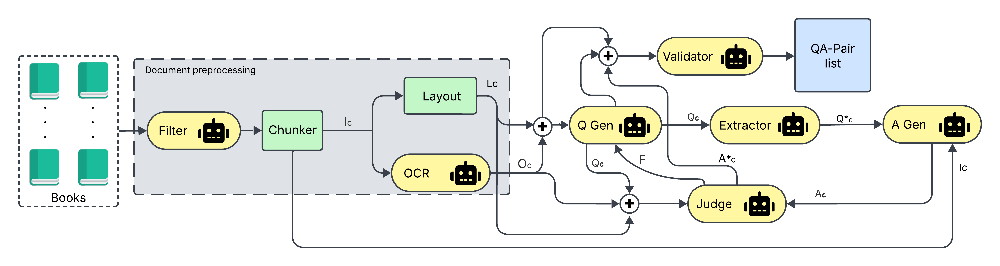

# Automated QA Pair Generation Pipeline

This diagram illustrates a system designed to automatically generate Question-Answer (QA) pairs from a collection of documents (Books). The pipeline involves document preprocessing, question generation, answer generation/extraction, validation, and evaluation components, utilizing various processing steps and potentially AI/ML models (indicated by the robot icons).

## Diagram Overview

The system takes a set of books as input and processes them through several stages:

1.  **Document Preprocessing:** Preparing the raw document content.
2.  **Core QA Generation & Evaluation:** Generating questions and answers, evaluating their quality.
3.  **Validation:** Ensuring the generated pairs meet certain criteria.
4.  **Output:** A list of validated QA pairs.

## Process Flow

1.  Input documents (`Books`) are fed into the `Document preprocessing` stage.
2.  The `Filter` selects relevant content from the documents.
3.  The filtered content is passed to the `Chunker`, which breaks it down into smaller, manageable chunks (`Ic`).
4.  These chunks (`Ic`) are processed in parallel by two modules:
    *   `Layout`: Analyzes the structural and layout information (`Lc`).
    *   `OCR`: Performs Optical Character Recognition to extract text content (`Oc`).
5.  The chunked content (`Ic`) and OCR output (`Oc`) are combined and fed into the `Q Gen` (Question Generator).
6.  `Q Gen` generates questions (`Qc`) based on the input. It also receives feedback (`F`) from the `Judge`.
7.  The generated questions (`Qc`) are passed to the `Extractor`, which attempts to find or extract answers (`A*c`) directly from the document chunks.
8.  Simultaneously, potentially a refined version of the question and context (`Q*c`) along with the original chunk (`Ic`) are fed to the `A Gen` (Answer Generator), which generates answers (`Ac`).
9.  The extracted answers (`A*c`) and generated answers (`Ac`) are combined and fed into the `Judge`.
10. The `Judge` evaluates the quality of the generated and extracted answers, providing feedback (`F`) back to the `Q Gen` to potentially improve future question generation.
11. The layout information (`Lc`) and potentially the generated questions/answers are combined and sent to the `Validator`.
12. The `Validator` checks the quality and validity of the generated QA pairs against criteria (potentially using layout info or other signals).
13. Validated QA pairs are added to the final `QA-Pair list`.

## Components

*   **Books:** The initial input source - a collection of documents.
*   **Document preprocessing:** A stage encompassing initial steps to prepare documents.
    *   **Filter (🤖):** Selects or preprocesses raw document content. (Robot icon suggests automation or ML).
    *   **Chunker:** Splits the processed content into smaller pieces (`Ic`).
    *   **Layout:** Analyzes document structure and layout (`Lc`).
    *   **OCR (🤖):** Extracts text from images or scans (`Oc`). (Robot icon suggests automation or ML).
*   **Q Gen (🤖):** Question Generator. Creates questions (`Qc`) based on document content (`Ic`, `Oc`). Learns from feedback (`F`). (Robot icon suggests AI/ML/LLM).
*   **Extractor (🤖):** Extracts answers (`A*c`) from document content given a question (`Qc`). (Robot icon suggests AI/ML/LLM).
*   **A Gen (🤖):** Answer Generator. Creates answers (`Ac`) potentially differently from extraction, using context (`Ic`) and questions (`Q*c`). (Robot icon suggests AI/ML/LLM).
*   **Judge (🤖):** Evaluates the quality of generated (`Ac`) and extracted (`A*c`) answers and provides feedback (`F`). (Robot icon suggests AI/ML evaluation model or scoring).
*   **Validator (🤖):** Validates the final QA pairs (`QA-Pair list`), potentially using layout information (`Lc`) and other checks. (Robot icon suggests automation or ML).
*   **QA-Pair list:** The final output of the system - a list of high-quality, validated question-answer pairs derived from the input documents.
*   **+ icons:** Represent points where different data streams are combined or integrated.

## Inputs

*   A collection of documents (illustrated as `Books`).

## Outputs

*   A list of generated and validated Question-Answer pairs (`QA-Pair list`).

## Data Streams

*   `Ic`: Chunked Content
*   `Lc`: Layout Information
*   `Oc`: OCR Text
*   `Qc`: Generated Questions
*   `A*c`: Extracted Answers
*   `Ac`: Generated Answers
*   `F`: Feedback from Judge
*   `Q*c`: Potentially refined Question + Context for A Gen

This pipeline represents a sophisticated approach to automating the creation of QA datasets from large document collections, incorporating multiple steps for robust generation and validation.

## Execution
Check out multi_agent_interactive.py in the main folder
